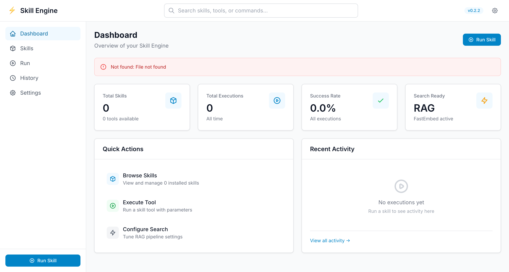
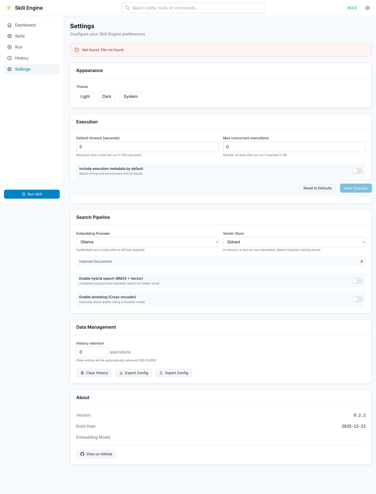

<h1 align="center">
  <br>
  Skill
  <br>
</h1>

<h3 align="center">Give your AI agent superpowers through the terminal</h3>

<p align="center">
  <a href="#"></a>
  <a href="#"></a>
  <a href="#"></a>
  <a href="https://github.com/kubiyabot/skill/actions/workflows/claude-bridge-tests.yml"></a>
  <a href="https://codecov.io/gh/kubiyabot/skill"></a>
  <a href="#license"></a>
</p>

<p align="center">
  <a href="https://www.skill-ai.dev/">Documentation</a> •
  <a href="https://github.com/kubiyabot/skill/discussions">Community</a> •
  <a href="#quick-start">Quick Start</a> •
  <a href="CONTRIBUTING.md">Contributing</a> •
  <a href="ROADMAP.md">Roadmap</a>
</p>

---

## The Core Idea

**AI agents need to do things in the real world.** Query databases. Deploy code. Manage infrastructure. Call APIs.

Today, you have two choices:

1. **Stuff tool docs into prompts** → Context bloat, hallucinated flags, model confusion
2. **Run MCP servers** → Complex setup, always-on processes, protocol overhead

**Skill is a third way.** A universal skill runtime that:

- **Runs anywhere** — Single binary, no servers required
- **Stays secure** — WASM sandbox with capability-based permissions
- **Finds tools intelligently** — Local semantic search, zero context cost
- **Works with any agent** — CLI commands or MCP protocol

```bash
# Discover tools with natural language
$ skill find "manage kubernetes pods"

[95%] kubernetes → get
      Get Kubernetes resources (pods, deployments, services, etc.)

      Usage: skill run kubernetes:get --resource pods --namespace default

# Execute in sandboxed WASM
$ skill run kubernetes:get --resource pods --all-namespaces
```

---

## Two Ways to Use

### 1. CLI Mode (Default)

Perfect for Claude Code, Aider, Codex, or any terminal-based agent:

```bash
# Add to your agent's instructions
skill find "<what you want to do>"   # Discover tools
skill run <skill>:<tool> [args]      # Execute tools
skill list                           # See what's installed
```

The agent uses shell commands. No SDK, no protocol, no complexity.

### 2. MCP Server Mode

For agents that speak Model Context Protocol:

```bash
# Start the MCP server
skill serve
```

**Tools exposed:**

| Tool | Description |
|------|-------------|
| `execute` | Run any skill tool with arguments |
| `list_skills` | Discover available skills (with pagination) |
| `search_skills` | Semantic search across all tools |

```json
// Claude Desktop / VS Code configuration
{
  "mcpServers": {
    "skill": {
      "command": "skill",
      "args": ["serve"]
    }
  }
}
```

The same skills work in both modes. Write once, use everywhere.

---

## Quick Start

### Install

**Via Cargo (recommended):**

```bash
cargo install skill-cli
```

> **Prerequisites:** Rust is required. Install from [rustup.rs](https://rustup.rs/).

**From source:**

```bash
git clone https://github.com/kubiyabot/skill
cd skill
cargo install --path crates/skill-cli
```

**Verify installation:**

```bash
skill --version
```

### Programmatic Installation

**Python:**

```python
import subprocess, shutil

def ensure_skill_installed():
    if shutil.which("skill"):
        return True
    subprocess.run(["cargo", "install", "skill-cli"], check=True)
    return True
```

**GitHub Actions:**

```yaml
- name: Install Rust
  uses: dtolnay/rust-toolchain@stable

- name: Install Skill
  run: cargo install skill-cli
```

### Install a Skill

```bash
# From a local directory with SKILL.md
skill install ./examples/kubernetes-skill

# List installed skills
skill list
```

### Use It

```bash
# Semantic search for tools
skill find "list kubernetes pods"

# Run a tool
skill run kubernetes:get --resource namespaces

# Get detailed skill info
skill info kubernetes
```

### Start MCP Server

```bash
# Stdio mode (for Claude Code, etc.)
skill serve

# HTTP streaming mode (with embedded web UI)
skill serve --http --port 3000
```

The HTTP mode includes an embedded web interface at `http://127.0.0.1:3000/` for managing skills through your browser.

---

## Web Interface

Skill Engine includes a modern web UI built with Yew (Rust + WebAssembly) for browser-based skill management.

### Starting the Web UI

```bash
# Start the server (includes both web UI and MCP API)
skill serve --http --port 3000

# Then open your browser to:
# http://127.0.0.1:3000/
```

### Screenshots

**Dashboard**



Overview of all installed skills with quick actions and recent activity.

**Skills Browser**


Search, filter, and manage installed skills with detailed information.

**Tool Execution**


Execute skill tools with dynamic parameter forms and real-time output.

**Settings**



Configure search pipeline, execution preferences, and system settings.

### Features

**Dashboard**
- Overview of all installed skills
- Quick execution of recently used tools
- System health and statistics

**Skills Browser**
- Search and filter installed skills
- View detailed skill information
- Install new skills from URLs or local paths

**Tool Execution**
- Dynamic parameter forms for each tool
- Service requirement detection and management
- Real-time output with syntax highlighting
- Multiple output formats (JSON, Pretty, Raw)

**Service Management**
- Automatic detection of required services (e.g., kubectl proxy)
- One-click service startup
- Real-time service status indicators
- Automatic URL injection for dependent tools

### Documentation

For detailed web interface documentation, including:
- API endpoints
- Service requirements configuration
- Building the web UI from source
- Architecture and development

See [docs/web-interface.md](docs/web-interface.md)

---

## MCP Server

The MCP server exposes all installed skills to any MCP-compatible client.

### Features

- **Dynamic Tool Discovery** — Skills are discovered automatically from manifest
- **Semantic Search** — Find tools by description using local vector embeddings
- **Pagination** — Handle large skill catalogs efficiently
- **Native Command Execution** — SKILL.md-based skills execute real commands
- **HTTP Streaming** — SSE support for web integrations

### MCP Tools

#### `execute`

Execute any skill tool:

```json
{
  "name": "execute",
  "arguments": {
    "skill": "kubernetes",
    "tool": "get",
    "args": {
      "resource": "pods",
      "namespace": "default"
    }
  }
}
```

#### `list_skills`

List available skills with pagination:

```json
{
  "name": "list_skills",
  "arguments": {
    "offset": 0,
    "limit": 10,
    "skill": "kubernetes"  // optional filter
  }
}
```

Response includes pagination metadata:
```
📊 Pagination: Showing 10 of 19 tools (offset: 0, limit: 10)
💡 Next page: Use offset=10
```

#### `search_skills`

Semantic search across all tools:

```json
{
  "name": "search_skills",
  "arguments": {
    "query": "scale deployment replicas",
    "top_k": 5
  }
}
```

Uses local FastEmbed vectors — no API keys required, works offline.

### Claude Code Integration

The easiest way to integrate with Claude Code:

```bash
# Auto-configure Claude Code (adds to .mcp.json)
skill claude setup

# Check status
skill claude status

# Remove integration
skill claude remove
```

This gives Claude access to all your installed skills. Example prompts:

- *"List all kubernetes pods"*
- *"Find a tool to convert video to GIF"*
- *"Scale the nginx deployment to 3 replicas"*

### Manual Configuration

Add to `.mcp.json` in your project:

```json
{
  "mcpServers": {
    "skill-engine": {
      "type": "stdio",
      "command": "skill",
      "args": ["serve"]
    }
  }
}
```

For Claude Desktop, add to `~/Library/Application Support/Claude/claude_desktop_config.json`:

```json
{
  "mcpServers": {
    "skill": {
      "command": "skill",
      "args": ["serve"]
    }
  }
}
```

---

## Architecture

```
┌─────────────────────────────────────────────────────────────────┐
│                         AI Agent                                 │
│  (Claude Code, Claude Desktop, Cursor, custom agents)          │
└─────────────────────────────────────────────────────────────────┘
                              │
                              ▼
              ┌───────────────┴───────────────┐
              │                               │
              ▼                               ▼
     ┌────────────────┐            ┌────────────────────┐
     │   CLI Mode     │            │   MCP Server Mode  │
     │                │            │                    │
     │  skill find    │            │  skill serve       │
     │  skill run     │            │                    │
     │  skill list    │            │  Tools:            │
     │                │            │  - execute         │
     │                │            │  - list_skills     │
     │                │            │  - search_skills   │
     └────────────────┘            └────────────────────┘
              │                               │
              └───────────────┬───────────────┘
                              │
                              ▼
     ┌─────────────────────────────────────────────────────────────┐
     │                    Skill Runtime (Wasmtime)                 │
     │                                                             │
     │  ┌─────────────┐  ┌─────────────┐  ┌─────────────┐         │
     │  │ kubernetes  │  │    aws      │  │   github    │   ...   │
     │  │   skill     │  │   skill     │  │   skill     │         │
     │  └─────────────┘  └─────────────┘  └─────────────┘         │
     │                                                             │
     │  • WASM sandbox isolation                                   │
     │  • Capability-based security                                │
     │  • Local vector search (FastEmbed)                          │
     │  • Native command execution (for SKILL.md skills)           │
     └─────────────────────────────────────────────────────────────┘
```

### Why WASM?

| Property | Benefit |
|----------|---------|
| **Sandboxed by default** | Skills can't escape their boundaries |
| **Portable binaries** | Same skill runs on macOS, Linux, Windows |
| **Near-native speed** | <10ms warm start with AOT compilation |
| **Language agnostic** | Write in Rust, JavaScript, Python, Go |
| **Deterministic** | Same inputs → same outputs, always |

### Why Local Vector Search?

- **Zero context cost** — Tool docs stay in the index, not your prompt
- **Offline capable** — No API calls, works in air-gapped environments
- **Fast** — ~50ms search using all-MiniLM-L6-v2
- **Privacy** — Your queries never leave your machine

---

## Advanced RAG Search

Skill Engine includes a production-ready RAG (Retrieval-Augmented Generation) pipeline for intelligent tool discovery.

### Features

| Feature | Description |
|---------|-------------|
| **Hybrid Search** | Combines dense vectors + BM25 sparse search with RRF fusion |
| **Cross-encoder Reranking** | Improves precision with bi-encoder reranking models |
| **Query Understanding** | Intent classification and entity extraction |
| **Context Compression** | Token-efficient output for LLM consumption |
| **Persistent Indexing** | Incremental updates with content-hash change detection |

### Search Configuration

Configure search behavior in `skill.toml`:

```toml
[search]
backend = { type = "inmemory" }  # or "qdrant" for production

[search.embedding]
provider = "fastembed"           # fastembed, openai, ollama
model = "all-minilm"
dimensions = 384

[search.retrieval]
enable_hybrid = true
dense_weight = 0.7
sparse_weight = 0.3
final_k = 5

[search.reranker]
enabled = true
model = "bge-reranker-base"

[search.context]
max_total_tokens = 800
compression = "template"         # extractive, template, progressive, none
```

### Environment Variables

Override configuration at runtime:

```bash
SKILL_SEARCH_BACKEND=qdrant
SKILL_EMBEDDING_PROVIDER=openai
SKILL_EMBEDDING_MODEL=text-embedding-3-small
SKILL_RERANKER_ENABLED=true
QDRANT_URL=http://localhost:6334
```

### Feature Flags

Enable optional features during compilation:

```bash
cargo build -p skill-runtime --features hybrid-search,reranker,context-compression,qdrant
```

| Feature | Dependencies | Description |
|---------|--------------|-------------|
| `hybrid-search` | tantivy | BM25 + Reciprocal Rank Fusion |
| `reranker` | fastembed | Cross-encoder reranking |
| `context-compression` | tiktoken-rs | Token-aware compression |
| `qdrant` | qdrant-client | Production vector database |

---

## Creating Skills

### Option 1: SKILL.md (Recommended for CLI tools)

Create a `SKILL.md` file that describes tools and maps them to native commands:

```markdown
---
name: kubernetes
description: Kubernetes cluster management with kubectl
allowed-tools: Bash
---

# Kubernetes Skill

Manage Kubernetes clusters with real kubectl integration.

## Tools Provided

### get

Get Kubernetes resources (pods, deployments, services, etc.)

**Parameters:**
- `resource` (required, string): Resource type (pods, deployments, services)
- `namespace` (optional, string): Kubernetes namespace
- `replicas` (optional, integer): Number of replicas
- `all` (optional, boolean, default: false): Query all namespaces
- `output` (optional, enum: json|yaml|wide): Output format

**Examples:**
```bash
skill run kubernetes:get resource=pods
skill run kubernetes:get resource=deployments namespace=production
skill run kubernetes:get resource=nodes output=wide
```
```

**Parameter Format:**
- `(required)` / `(optional)` - Whether the parameter is mandatory
- Type hints: `string`, `integer`, `number`, `boolean`, `array`, `object`
- Default values: `default: value`
- Enums: `enum: value1|value2|value3`

Install with:
```bash
skill install ./my-skill-directory
```

### Option 2: WASM Component (For custom logic)

**JavaScript/TypeScript:**

```typescript
export const tools = [{
  name: "greet",
  description: "Greet someone by name",
  parameters: {
    name: { type: "string", required: true }
  }
}];

export function greet(args: { name: string }): string {
  return JSON.stringify({ message: `Hello, ${args.name}!` });
}
```

```bash
npx jco componentize skill.js -o skill.wasm
skill install ./skill.wasm
```

**Rust:**

```rust
use skill_sdk::prelude::*;

#[skill]
pub fn greet(name: String) -> SkillResult {
    Ok(json!({ "message": format!("Hello, {name}!") }))
}
```

```bash
cargo build --target wasm32-wasip2 --release
skill install ./target/wasm32-wasip2/release/skill.wasm
```

---

## Security Model

### Capability-Based Access

Skills declare what they need at install time:

```yaml
capabilities:
  network:
    - "*.amazonaws.com"
  filesystem:
    - read: "${args.file}"
  allowed-tools:    # For SKILL.md native execution
    - kubectl
    - helm
```

### What Skills Cannot Do

| Blocked | Enforcement |
|---------|-------------|
| Read arbitrary files | WASI filesystem not mounted |
| Access unrequested network | WASI sockets allowlist |
| Run arbitrary commands | Command allowlist for native execution |
| Persist state | Memory cleared after execution |

---

## CLI Reference

```bash
# Discovery
skill find <query>              # Semantic search for tools
skill list                      # List installed skills
skill info <skill>              # Show skill details

# Execution
skill run <skill>:<tool> [args] # Run a tool
skill run aws@prod:s3-list      # Run with named instance

# Installation
skill install <path>            # Install from directory
skill install ./skill.wasm      # Install WASM directly
skill remove <skill>            # Uninstall

# MCP Server
skill serve                     # Start stdio MCP server
skill serve --http --port 8080  # Start HTTP streaming server

# Configuration
skill config <skill>            # Configure credentials
skill config <skill> -i prod    # Named instance config
```

---

## Performance

| Metric | Value |
|--------|-------|
| Cold start | ~100ms (includes AOT compilation) |
| Warm start | <10ms (cached) |
| Vector search | <50ms |
| MCP tool call | <100ms typical |

---

## Testing

Run the comprehensive MCP integration tests:

```bash
./tests/mcp_integration_tests.sh
```

45 tests covering:
- MCP protocol handshake
- Tool listing and pagination
- Skill execution
- Semantic search
- Error handling
- Concurrent requests

---

## Project Structure

```
skill/
├── crates/
│   ├── skill-cli/        # CLI binary (skill command)
│   ├── skill-runtime/    # WASM execution engine
│   └── skill-mcp/        # MCP server implementation
├── docs/
│   ├── skill-development.md  # Skill authoring guide
│   ├── rag-search.md         # RAG pipeline documentation
│   └── project-status.md     # Implementation status
├── sdk/
│   ├── javascript/       # JavaScript/TypeScript SDK
│   └── python/           # Python SDK
├── examples/
│   ├── kubernetes-skill/ # Real-world SKILL.md example
│   └── hello-skill/      # Minimal WASM example
├── tests/
│   └── mcp_integration_tests.sh
└── wit/
    └── skill.wit         # WIT interface definition
```

---

## Roadmap

**Working Now**
- WASM Component Model execution
- CLI: install, run, find, list, info, remove
- MCP server with stdio and HTTP streaming
- Semantic search with FastEmbed
- SKILL.md native command execution
- Multi-instance configuration
- Comprehensive test suite
- Curl one-liner installation
- GitHub Actions release automation
- **Advanced RAG Pipeline**:
  - VectorStore trait with InMemory and Qdrant backends
  - Multiple embedding providers (FastEmbed, OpenAI, Ollama)
  - Hybrid search (dense + BM25 with RRF)
  - Cross-encoder reranking
  - Token-aware context compression
  - Query understanding (intent + entity extraction)
  - Persistent index management with incremental updates
  - Comprehensive TOML configuration schema

**Coming Soon**
- Pre-built binaries on releases
- Public skill registry
- Homebrew tap
- Docker image
- Skill versioning and updates
- More language SDKs

---

## Documentation

| Guide | Description |
|-------|-------------|
| [Skill Development](docs/skill-development.md) | How to create skills |
| [Web Interface](docs/web-interface.md) | Web UI features and API reference |
| [RAG Search](docs/rag-search.md) | Advanced search pipeline |
| [Project Status](docs/project-status.md) | Implementation roadmap |

---

## Contributing

```bash
git clone https://github.com/kubiyabot/skill
cd skill
cargo build
cargo test
./tests/mcp_integration_tests.sh
```

---

## License

Skill is licensed under the [MIT License](LICENSE).

## Support

- **Documentation**: https://www.skill-ai.dev/
- **Discussions**: [GitHub Discussions](https://github.com/kubiyabot/skill/discussions)
- **Issues**: [GitHub Issues](https://github.com/kubiyabot/skill/issues)
- **Security**: See [SECURITY.md](SECURITY.md)

---

<p align="center">
  <strong>Skill</strong><br>
  Give your AI agent superpowers.<br>
  Secure. Portable. Universal.
</p>
